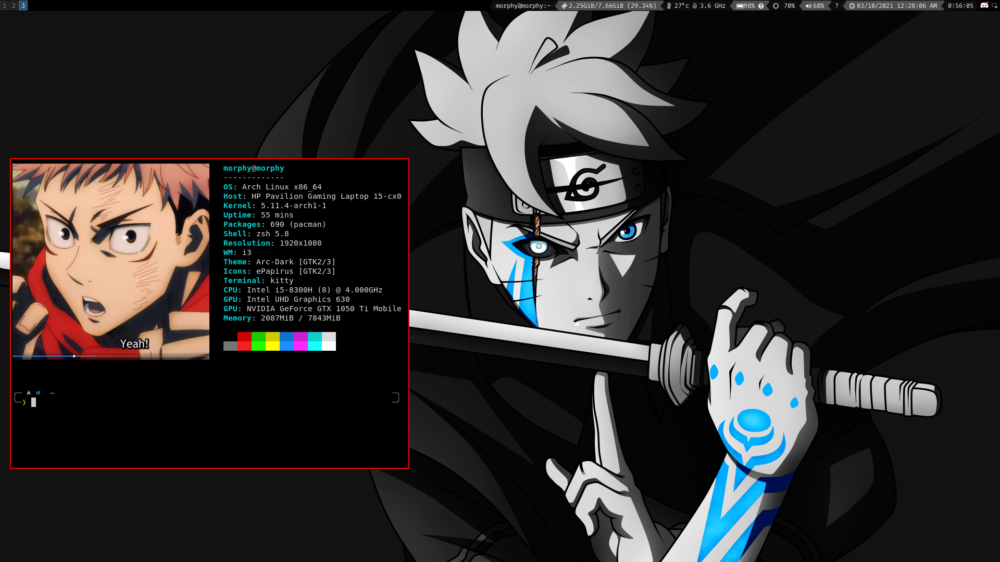

<h1 align="center">
  
</h1>

  &nbsp;
  

 *  🧠  𝙸𝚗𝚝𝚎𝚛𝚎𝚜𝚝𝚎𝚍 𝚒𝚗 𝙳𝚎𝚟𝙾𝚙𝚜

 *  ⚡  𝙻𝚒𝚗𝚞𝚡 𝙴𝚗𝚝𝚑𝚞𝚜𝚒𝚊𝚜𝚝

 *  &nbsp; 𝚋𝚝𝚠 𝙸 𝚞𝚜𝚎 𝙰𝚛𝚌𝚑

 *  🔭  𝙲𝚞𝚛𝚛𝚎𝚗𝚝𝚕𝚢 𝚠𝚘𝚛𝚔𝚒𝚗𝚐 𝚘𝚗 ...

 *  🌱  𝙲𝚞𝚛𝚛𝚎𝚗𝚝𝚕𝚢 𝚕𝚎𝚊𝚛𝚗𝚒𝚗𝚐 ...

### 𝚂𝚔𝚒𝚕𝚕𝚜

**𝙵𝚛𝚘𝚗𝚝𝚎𝚗𝚍**

**𝙱𝚊𝚌𝚔𝚎𝚗𝚍**

**𝙳𝚊𝚝𝚊𝚋𝚊𝚜𝚎𝚜**

**𝚃𝚘𝚘𝚕𝚜 & 𝙳𝚎𝚟𝙾𝚙𝚜**

### 📊 𝙶𝚒𝚝𝙷𝚞𝚋 𝚂𝚝𝚊𝚝𝚜

### 🎶 𝙻𝚒𝚜𝚝𝚎𝚗𝚒𝚗𝚐 𝚝𝚘 𝙼𝚞𝚜𝚒𝚌

### 💻 𝙳𝚎𝚜𝚔𝚝𝚘𝚙

### 𝙲𝚘𝚗𝚗𝚎𝚌𝚝 𝚠𝚒𝚝𝚑 𝚖𝚎

&nbsp;

