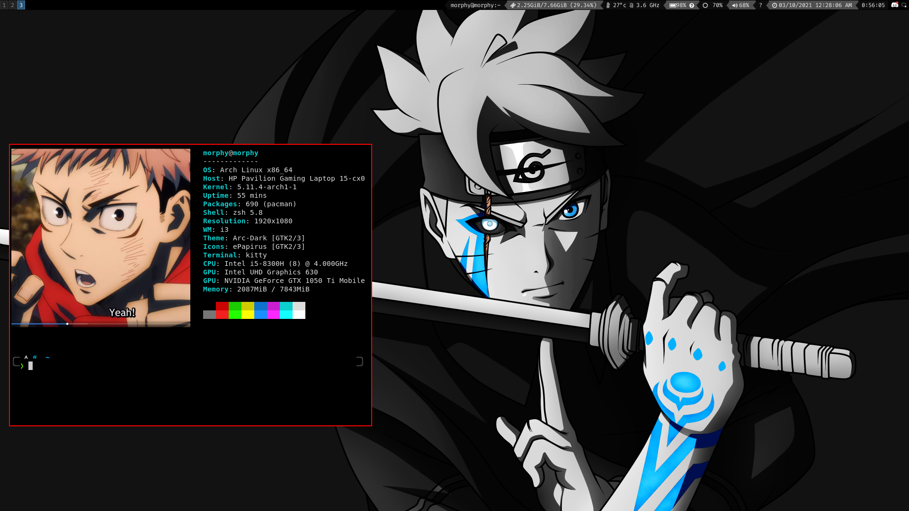

<h1 align="center"> 𝙷𝚒   𝙼𝚢 𝚗𝚊𝚖𝚎 𝚒𝚜 𝙱𝚒𝚋𝚎𝚔  </h1>

 *  🌱 𝙸'𝚖 𝚕𝚎𝚊𝚛𝚗𝚒𝚗𝚐 𝙼𝙴𝚁𝙽 𝚂𝚝𝚊𝚌k

 *  🧠  𝙸𝚗𝚝𝚛𝚎𝚜𝚝𝚎𝚍 𝚒𝚗 𝙳𝚎𝚟𝙾𝚙𝚜
 
 *  ⚡  𝙻𝚒𝚗𝚞𝚡 𝙴𝚗𝚝𝚑𝚞𝚜𝚒𝚊𝚜𝚝

 *  &nbsp; 𝚋𝚝𝚠 𝙸 𝚞𝚜𝚎 𝙰𝚛𝚌𝚑  

### 𝚂𝚔𝚒𝚕𝚕𝚜

   
<a href="https://www.vim.org/" target="_blank" rel="noreferrer">

### 🎶 𝙻𝚒𝚜𝚝𝚎𝚗𝚒𝚗𝚐 𝚝𝚘 𝙼𝚞𝚜𝚒𝚌

### 💻 𝙳𝚎𝚜𝚔𝚝𝚘𝚙

### 𝚂𝚘𝚌𝚒𝚊𝚕𝚜

 
&nbsp;

### 𝙱𝚊𝚍𝚐𝚎𝚜

𝙼𝚢 𝙶𝚒𝚝𝙷𝚞𝚋 𝚂𝚝𝚊𝚝𝚜

